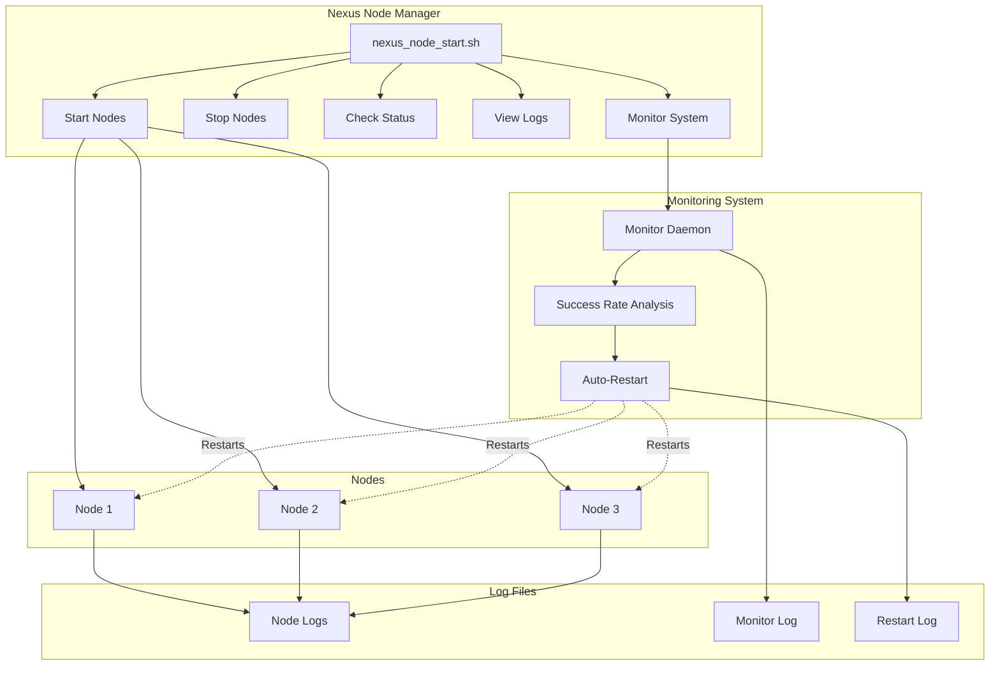

# Nexus Network Node Manager

A bash script to manage multiple Nexus network nodes with different node IDs.

## Features

- Start, stop, and monitor multiple Nexus nodes
- View real-time logs and status
- Auto-restart nodes on failure
- Monitor success/error rates
- Log rotation to prevent disk space issues
- Detailed monitoring with configurable parameters
- Automatic dependency check for Nexus Network CLI

## System Architecture



## Quick Start

1. Clone this repository
2. Create a configuration file (see below)
3. Install Nexus Network CLI: `curl https://cli.nexus.xyz/ | sh`
4. Start your nodes: `./nexus_node_start.sh start`
5. Check status: `./nexus_node_start.sh status`
6. Start monitoring: `./nexus_node_start.sh monitor start`

## Installation

1. Download the script:
   ```bash
   git clone https://github.com/yourusername/nexus-network-manager.git
   cd nexus-network-manager
   chmod +x nexus_node_start.sh
   ```

2. Install the Nexus Network CLI:
   ```bash
   curl https://cli.nexus.xyz/ | sh
   ```
   
   After installation, restart or refresh your terminal:
   ```bash
   # For Bash
   source ~/.bashrc
   
   # For Zsh
   source ~/.zshrc
   
   # Or simply open a new terminal window
   ```
   
   Note: The script will automatically check if the CLI is installed and prompt you to install it if it's not.

3. Create a configuration file named `nexus_config.conf` in the same directory:
   ```bash
   # Create configuration file with example settings
   cat > nexus_config.conf << 'EOL'
   # List of node IDs to manage
   NODE_IDS=(6515746 6515747 6515748)

   # Log rotation settings
   MAX_LOG_SIZE_MB=25
   MAX_LOG_FILES=3

   # Monitor settings
   MONITOR_ENABLED=true
   MONITOR_INTERVAL=30  # seconds
   SUCCESS_RATE_THRESHOLD=60  # percentage
   MIN_LOG_ENTRIES=20
   RESTART_COOLDOWN=300  # seconds
   ENABLE_NOTIFICATIONS=true
   LOG_RESTART_ACTIONS=true
   EOL
   ```

4. Make sure you have the `nexus-network` command in your PATH

## Configuration

Edit the `nexus_config.conf` file to customize your settings:

| Parameter | Description | Default |
|-----------|-------------|---------|
| `NODE_IDS` | Array of node IDs to manage | (required) |
| `MAX_LOG_SIZE_MB` | Maximum log file size before rotation | 25 |
| `MAX_LOG_FILES` | Number of log backups to keep | 2 |
| `MONITOR_ENABLED` | Enable/disable monitoring | false |
| `MONITOR_INTERVAL` | Seconds between monitoring checks | 30 |
| `SUCCESS_RATE_THRESHOLD` | Minimum success rate percentage | 60 |
| `MIN_LOG_ENTRIES` | Minimum log entries for rate calculation | 20 |
| `RESTART_COOLDOWN` | Seconds to wait before restarting same node | 300 |
| `ENABLE_NOTIFICATIONS` | Show notifications when monitor takes action | true |
| `LOG_RESTART_ACTIONS` | Log all restart actions | true |

## Example Workflow

Here's a typical workflow for managing your Nexus nodes:

### Initial Setup

```bash
# Create required directories
mkdir -p logs run

# Start all nodes
./nexus_node_start.sh start
# Output will show the PIDs of the started nodes

# Check status to ensure nodes are running
./nexus_node_start.sh status

# Start monitoring (only running nodes will be monitored)
./nexus_node_start.sh monitor start

# Check monitor status to see which nodes are being monitored
./nexus_node_start.sh monitor status
```

### Daily Operations

```bash
# Check node status each morning
./nexus_node_start.sh status

# Check error/success rates
./nexus_node_start.sh rates

# Check if any nodes were restarted overnight
cat run/nexus_restart.log

# View recent monitor events
./nexus_node_start.sh monitor status
```

### Maintenance

```bash
# To restart a specific node for maintenance
./nexus_node_start.sh restart 6515746

# To temporarily remove a node from monitoring
./nexus_node_start.sh monitor remove 6515746

# Perform maintenance, then re-add to monitoring
./nexus_node_start.sh monitor add 6515746

# To restart the entire cluster
./nexus_node_start.sh stop
./nexus_node_start.sh start
```

## Usage

### Basic Commands

```bash
# Start all nodes
./nexus_node_start.sh start

# Start a specific node
./nexus_node_start.sh start 6515746

# Check status of all nodes
./nexus_node_start.sh status

# Check status of a specific node
./nexus_node_start.sh status 6515746

# Stop all nodes
./nexus_node_start.sh stop

# Stop a specific node
./nexus_node_start.sh stop 6515746

# View logs (tail -f) for a specific node
./nexus_node_start.sh log 6515746

# View error/success rates for all nodes
./nexus_node_start.sh rates

# Restart all nodes
./nexus_node_start.sh restart
```

### Monitoring Commands

```bash
# Start monitoring daemon
./nexus_node_start.sh monitor start

# Force start monitoring even if no nodes are running
./nexus_node_start.sh monitor start --force

# Check monitoring status
./nexus_node_start.sh monitor status

# View monitoring logs
./nexus_node_start.sh monitor log

# Stop monitoring
./nexus_node_start.sh monitor stop

# Add a node to monitoring
./nexus_node_start.sh monitor add 6515746

# Remove a node from monitoring
./nexus_node_start.sh monitor remove 6515746
```

## Monitoring System

The monitoring system tracks node health and can automatically restart nodes if:

1. A node process stops running
2. A node's success rate falls below the configured threshold

### How Monitoring Works

1. Only monitors nodes that are running when the monitor starts (or manually added)
2. Calculates success/error rates from recent log entries
3. Restarts nodes that fail or have low success rates
4. Applies a cooldown period to prevent excessive restarts
5. Maintains separate logs for monitor events and restart actions

### Log Files

- Node logs: `logs/nexus_node_<node_id>.log`
- Monitor log: `run/nexus_monitor.log`
- Restart log: `run/nexus_restart.log`

## Troubleshooting

### Node won't start

Check the node's log file for errors:
```bash
cat logs/nexus_node_<node_id>.log
```

### Monitor not restarting failed nodes

1. Check if the node is in the monitored nodes list:
   ```bash
   ./nexus_node_start.sh monitor status
   ```

2. Check the monitor log for events:
   ```bash
   ./nexus_node_start.sh monitor log
   ```

3. Verify monitor is running:
   ```bash
   ./nexus_node_start.sh monitor status
   ```

### Managing Stale PIDs

If the script reports a node is running but it's not:
```bash
# Stop the node to clean up the PID file
./nexus_node_start.sh stop <node_id>

# Then start it again
./nexus_node_start.sh start <node_id>
```

## License

[Specify your license here]

## Conclusion

The Nexus Network Node Manager is designed to simplify the operation and maintenance of multiple Nexus network nodes. With its automated monitoring and restart capabilities, you can ensure maximum uptime for your nodes while minimizing manual intervention.

Key benefits:
- Simplifies managing multiple nodes from a single interface
- Provides detailed error and success rate analytics
- Automatically recovers from failures
- Maintains comprehensive logs for troubleshooting
- Flexible configuration to meet your specific needs

For questions, issues, or contributions, please open a GitHub issue or submit a pull request. 